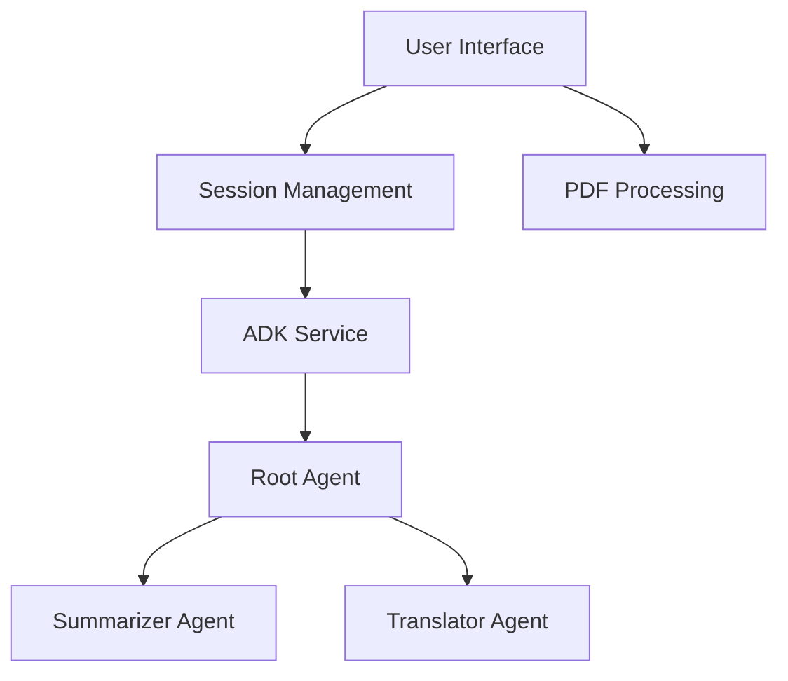

# Aura - Academic Research Assistant

## Overview
Aura is a powerful academic research assistant designed to help scholars, students, and researchers work with philosophical texts more efficiently. Built with Python and Streamlit, Aura leverages Google's Gemini AI model to provide intelligent text processing capabilities.

Key features include:
- **PDF Document Processing**: Upload and extract text from PDF documents
- **AI-Powered Summarization**: Generate concise, structured summaries of philosophical texts
- **Translation Services**: Translate content between English and Italian while maintaining academic tone
- **User-Friendly Interface**: Clean, intuitive web interface for easy interaction

Aura is designed for academic users who need to quickly understand, analyze, and work with complex philosophical texts. The application combines modern AI capabilities with a straightforward user experience to enhance research productivity.

## Table of Contents
- [Installation](#installation)
- [Configuration](#configuration)
- [Usage](#usage)
- [API Documentation](#api-documentation)
- [Architecture](#architecture)
- [Development](#development)
- [Testing](#testing)
- [Deployment](#deployment)
- [Performance](#performance)
- [Security](#security)
- [Contributing](#contributing)
- [License](#license)
- [Acknowledgements](#acknowledgements)

## Installation

### System Requirements
- Python 3.8 or higher
- pip (Python package manager)
- Internet connection (for Google API access)
- Sufficient disk space for dependencies (~500MB)

### Dependencies
Aura relies on several key Python libraries:
- streamlit: Web application framework
- google-adk: Google Agent Development Kit
- google-genai: Google Generative AI library
- pypdf: PDF processing library
- python-dotenv: Environment variable management
- nest-asyncio: Async event loop management

For a complete list of dependencies, see the [requirements.txt](requirements.txt) file.

### Installation Steps

1. **Clone the repository**
   ```bash
   git clone https://github.com/yourusername/aura.git
   cd aura
   ```

2. **Create a virtual environment (recommended)**
   ```bash
   # On Windows
   python -m venv venv
   venv\Scripts\activate

   # On macOS/Linux
   python -m venv venv
   source venv/bin/activate
   ```

3. **Install dependencies**
   ```bash
   pip install -r requirements.txt
   ```

4. **Set up Google API credentials**
   - Create a Google Cloud Platform account if you don't have one
   - Enable the Generative AI API in your Google Cloud Console
   - Create an API key for the Generative AI API
   - Create a `.env` file in the project root directory
   - Add your API key to the `.env` file:
     ```
     GOOGLE_API_KEY=your_api_key_here
     ```

5. **Verify installation**
   ```bash
   python -c "import streamlit; import google.adk; import google.genai; print('Installation successful!')"
   ```

## Configuration

Aura uses a combination of environment variables and configuration files to manage its settings.

### Environment Variables

Create a `.env` file in the project root directory with the following variables:

| Variable | Description | Required | Default |
|----------|-------------|----------|---------|
| `GOOGLE_API_KEY` | Your Google API key for accessing Gemini AI services | Yes | None |

Example `.env` file:
```
GOOGLE_API_KEY=your_api_key_here
```

### Configuration Files

#### Streamlit Configuration

Aura uses Streamlit's configuration system. The main configuration file is located at `.streamlit/config.toml`:

```toml
[theme]
base = "light"
primaryColor = "#e78ac3"
secondaryBackgroundColor = "#FFFFFF"
backgroundColor = "#cbd5e8"
font = "sans serif"
```

You can modify this file to customize the application's appearance.

#### Application Settings

Core application settings are defined in `config/settings.py`:

| Setting | Description | Default Value |
|---------|-------------|---------------|
| `MODEL_GEMINI` | The Google Gemini model version to use | "gemini-2.0-flash" |
| `APP_NAME_FOR_ADK` | Application name for ADK session management | "aura_app" |
| `USER_ID` | Default user ID for session management | "charlescro" |
| `MESSAGE_HISTORY_KEY` | Key for storing chat message history | "messages_final_mem_v2" |
| `ADK_SESSION_KEY` | Key for storing ADK session ID | "adk_session_id" |

To modify these settings, edit the `config/settings.py` file directly.

## Usage

### Starting the Application

To start the Aura application, run the following command from the project root directory:

```bash
streamlit run main.py
```

This will launch the Streamlit server and open the application in your default web browser. If it doesn't open automatically, you can access it at `http://localhost:8501`.

### Basic Workflow

Aura provides a straightforward workflow for processing academic texts:

1. **Upload a PDF Document**
   - Use the file uploader in the sidebar to select and upload a PDF file
   - The application will extract text from the PDF and display it

2. **View the Original Text**
   - Click the document icon (📚) to view the original extracted text
   - The text will be displayed in the main viewing area

3. **Generate a Summary**
   - Click the summary icon (📋) to generate an AI-powered summary of the text
   - The application will process the text using the Gemini AI model
   - The summary will be displayed in a structured format with key concepts highlighted

4. **Translate the Text**
   - Click the translate icon (🔄) to translate the current text
   - If the text is in English, it will be translated to Italian
   - If the text is in Italian, it will be translated to English
   - The translation maintains the academic tone and terminology

5. **Download Results**
   - Click the download icon (⬇️) to download the currently displayed content
   - The file will be saved in Markdown format

### Example Use Cases

#### Summarizing a Philosophical Text

1. Upload a PDF of a philosophical text (e.g., a chapter from Kant's "Critique of Pure Reason")
2. Click the summary icon
3. Review the AI-generated summary that highlights key concepts and arguments
4. Download the summary for your notes or research

#### Translating Academic Content

1. Upload a PDF of an Italian philosophical text
2. View the extracted text
3. Click the translate icon to get an English translation
4. Download the translation for reference

### Interface Elements


- **Sidebar**: Contains the file upload functionality
- **Top Bar**: Contains action buttons for viewing, summarizing, and translating
- **Main View**: Displays the current content (original text, summary, or translation)
- **Download Button**: Allows downloading the current content as a Markdown file

## API Documentation

Aura doesn't expose a public API for external consumption. Instead, it leverages Google's Agent Development Kit (ADK) and Generative AI API internally to provide its functionality.

### Internal API Usage

The application communicates with Google's services through the following components:

#### Google ADK Integration

The `services/adk_service.py` module handles communication with Google's ADK:

- `initialize_adk()`: Sets up the ADK runner and session management
- `run_adk_async()`: Asynchronously processes user requests through the ADK
- `run_adk_sync()`: Synchronous wrapper for ADK processing

#### Gemini AI Model

Aura uses the Gemini AI model for text processing:

- Model: `gemini-2.0-flash` (configurable in `config/settings.py`)
- Temperature: 0.1 (low temperature for more deterministic outputs)

If you need to integrate Aura with other systems, consider:

1. Using Streamlit's component system to embed Aura in other Streamlit applications
2. Extending the `adk_service.py` module to expose REST endpoints
3. Creating a wrapper script that calls the main application and processes its outputs

## Architecture

Aura follows a modular architecture that separates concerns and promotes maintainability. The application is built using Python with Streamlit for the frontend and Google's Agent Development Kit (ADK) for AI capabilities.

### Component Overview



### Key Components

#### User Interface (`ui/`)
- `streamlit_ui.py`: Main Streamlit interface that handles user interactions, file uploads, and display of results
- `assets/`: Contains static assets like the logo

#### Configuration (`config/`)
- `settings.py`: Central configuration for API keys, model settings, and application constants

#### Session Management (`utils/`)
- `session.py`: Manages Streamlit session state for persistent data across interactions

#### ADK Service (`services/`)
- `adk_service.py`: Handles communication with Google's ADK, including session management and request processing

#### Agent System (`aura_agent/`)
- `agent.py`: Defines the root agent that coordinates sub-agents
- `sub_agents/`: Contains specialized agents for specific tasks:
  - `summarizer/agent.py`: Specialized agent for text summarization
  - `translater/agent.py`: Specialized agent for text translation

### Data Flow

1. User uploads a PDF through the Streamlit interface
2. PDF text is extracted and stored in the session state
3. User requests an action (view, summarize, translate)
4. If summarization or translation is requested:
   - The request is sent to the ADK service
   - The root agent determines which sub-agent to use
   - The appropriate sub-agent processes the text
   - The result is returned to the UI and displayed
5. User can download the processed text as a Markdown file

### Technology Stack

- **Frontend**: Streamlit (Python-based web application framework)
- **Backend**: Python
- **AI/ML**: Google ADK with Gemini AI model
- **PDF Processing**: PyPDF library
- **Session Management**: Streamlit's session state and custom session handling
- **Async Processing**: nest_asyncio for handling nested event loops

## Development

This section provides guidelines for developers who want to extend or modify Aura.

### Development Environment Setup

1. Follow the installation steps in the [Installation](#installation) section
2. Install additional development dependencies:
   ```bash
   pip install black pytest pytest-cov
   ```

3. Configure your IDE for Python development
   - Recommended: Visual Studio Code with Python extension
   - Configure linting and formatting (see Code Style below)

### Code Style and Standards

Aura follows these coding standards:

- **PEP 8**: Standard Python style guide
- **Docstrings**: Google-style docstrings for all functions and classes
- **Type Hints**: Use Python type hints for function parameters and return values
- **Line Length**: Maximum 100 characters
- **Naming Conventions**:
  - Classes: CamelCase
  - Functions and variables: snake_case
  - Constants: UPPER_CASE
  - Private methods/variables: _leading_underscore

Example:
```python
def process_text(input_text: str, max_length: int = 1000) -> str:
    """
    Process the input text and return a modified version.
    
    Args:
        input_text: The text to process
        max_length: Maximum length of the processed text
        
    Returns:
        The processed text
    """
    # Implementation
    return processed_text
```

### Project Structure

When adding new features, follow the existing project structure:

- Place UI components in the `ui/` directory
- Add new agents in the `aura_agent/sub_agents/` directory
- Add new services in the `services/` directory
- Add utility functions in the `utils/` directory
- Add configuration in the `config/` directory

### Development Workflow

1. **Create a feature branch**
   ```bash
   git checkout -b feature/your-feature-name
   ```

2. **Make your changes**
   - Follow the code style guidelines
   - Add appropriate documentation
   - Update tests if necessary

3. **Test your changes locally**
   ```bash
   # Run the application
   streamlit run main.py
   
   # Run tests (if available)
   pytest
   ```

4. **Commit your changes**
   ```bash
   git add .
   git commit -m "Description of your changes"
   ```

5. **Push your changes and create a pull request**
   ```bash
   git push origin feature/your-feature-name
   ```

### Adding a New Sub-Agent

To add a new specialized agent:

1. Create a new directory in `aura_agent/sub_agents/your_agent_name/`
2. Create an `__init__.py` file
3. Create an `agent.py` file with your agent implementation:
   ```python
   from google.adk.agents import Agent
   from google.genai import types
   from config.settings import MODEL_GEMINI

   YOUR_AGENT_INSTRUCTION = """
   Detailed instructions for your agent...
   """

   your_agent = Agent(
       model=MODEL_GEMINI,
       name='your_agent_name',
       description='Description of your agent',
       generate_content_config=types.GenerateContentConfig(temperature=0.1),
       instruction=YOUR_AGENT_INSTRUCTION
   )
   ```
4. Import and register your agent in `aura_agent/agent.py`:
   ```python
   from .sub_agents.your_agent_name.agent import your_agent
   
   # Add to sub_agents list
   sub_agents=[summarizer, translater, your_agent]
   ```
5. Update the UI to include functionality for your new agent

## Testing

Aura doesn't currently have a formal testing framework implemented. This section provides recommendations for implementing tests and guidelines for manual testing.

### Recommended Testing Framework

For implementing automated tests, we recommend:

- **pytest**: A powerful Python testing framework
- **pytest-cov**: For measuring code coverage
- **streamlit-test**: For testing Streamlit components

### Suggested Test Structure

When implementing tests, consider the following structure:

```
tests/
├── unit/
│   ├── test_adk_service.py
│   ├── test_agents.py
│   └── test_helpers.py
├── integration/
│   ├── test_summarization.py
│   └── test_translation.py
└── ui/
    └── test_streamlit_ui.py
```

### Unit Testing Guidelines

For unit tests, focus on testing individual components in isolation:

- **ADK Service**: Test session management and API communication
- **Agents**: Test agent configuration and instruction formatting
- **Helpers**: Test utility functions

Example unit test for a helper function:

```python
# tests/unit/test_helpers.py
import pytest
from utils.helpers import your_helper_function

def test_your_helper_function():
    # Arrange
    input_data = "test input"
    expected_output = "expected result"
    
    # Act
    result = your_helper_function(input_data)
    
    # Assert
    assert result == expected_output
```

### Integration Testing Guidelines

For integration tests, focus on testing the interaction between components:

- Test the summarization workflow end-to-end
- Test the translation workflow end-to-end
- Test error handling and edge cases

### UI Testing Guidelines

For UI tests, focus on testing the Streamlit interface:

- Test file upload functionality
- Test button interactions
- Test display of results

### Manual Testing Checklist

Until automated tests are implemented, use this checklist for manual testing:

1. **Installation Testing**
   - [ ] Fresh installation works on a clean environment
   - [ ] All dependencies are correctly installed
   - [ ] Application starts without errors

2. **Configuration Testing**
   - [ ] Application correctly reads API key from .env file
   - [ ] Application handles missing API key gracefully
   - [ ] Configuration settings are correctly applied

3. **Functionality Testing**
   - [ ] PDF upload works correctly
   - [ ] Text extraction from PDF is accurate
   - [ ] Summarization produces meaningful results
   - [ ] Translation works for both English and Italian texts
   - [ ] Download functionality saves the correct content

4. **Error Handling Testing**
   - [ ] Application handles invalid PDFs gracefully
   - [ ] Application handles API errors gracefully
   - [ ] Application handles network issues gracefully

5. **Performance Testing**
   - [ ] Application handles large PDFs (>50 pages)
   - [ ] Response times are reasonable (<30 seconds for processing)

## Deployment

Aura can be deployed in various environments, from local development to production servers. This section covers different deployment options.

### Local Deployment

For local or personal use:

1. Follow the installation steps in the [Installation](#installation) section
2. Run the application:
   ```bash
   streamlit run main.py
   ```
3. Access the application at `http://localhost:8501`

### Server Deployment

For deploying on a server:

1. **Set up a Python environment on your server**
   ```bash
   # Install Python if not already installed
   sudo apt update
   sudo apt install python3 python3-pip python3-venv
   
   # Create a virtual environment
   python3 -m venv aura-env
   source aura-env/bin/activate
   ```

2. **Clone the repository and install dependencies**
   ```bash
   git clone https://github.com/yourusername/aura.git
   cd aura
   pip install -r requirements.txt
   ```

3. **Set up environment variables**
   ```bash
   # Create .env file
   echo "GOOGLE_API_KEY=your_api_key_here" > .env
   ```

4. **Run with Streamlit**
   ```bash
   # For development/testing
   streamlit run main.py
   
   # For production (using screen to keep it running)
   screen -S aura
   streamlit run main.py --server.port 8501 --server.address 0.0.0.0
   # Press Ctrl+A, then D to detach from screen
   ```

### Docker Deployment

For containerized deployment:

1. **Create a Dockerfile**
   ```dockerfile
   FROM python:3.9-slim
   
   WORKDIR /app
   
   COPY requirements.txt .
   RUN pip install --no-cache-dir -r requirements.txt
   
   COPY . .
   
   EXPOSE 8501
   
   CMD ["streamlit", "run", "main.py", "--server.port=8501", "--server.address=0.0.0.0"]
   ```

2. **Build and run the Docker container**
   ```bash
   # Build the image
   docker build -t aura-app .
   
   # Run the container
   docker run -p 8501:8501 --env-file .env aura-app
   ```

3. **Access the application at `http://localhost:8501`**

### Streamlit Cloud Deployment

For deployment on Streamlit Cloud:

1. Push your code to a GitHub repository
2. Sign up for [Streamlit Cloud](https://streamlit.io/cloud)
3. Create a new app and connect it to your GitHub repository
4. Add your `GOOGLE_API_KEY` as a secret in the Streamlit Cloud dashboard
5. Deploy the application

### Environment-Specific Configurations

For different deployment environments, consider:

1. **Development**
   - Use debug logging
   - Use development API keys

2. **Staging**
   - Use minimal logging
   - Use staging API keys
   - Implement basic authentication

3. **Production**
   - Use error-only logging
   - Use production API keys
   - Implement full authentication and HTTPS
   - Consider rate limiting for API calls

### Monitoring and Maintenance

Once deployed:

1. **Monitor application logs**
   ```bash
   # For local/server deployment
   tail -f streamlit_app.log
   
   # For Docker deployment
   docker logs -f aura-container
   ```

2. **Update the application**
   ```bash
   # Pull latest changes
   git pull
   
   # Update dependencies
   pip install -r requirements.txt
   
   # Restart the application
   # (method depends on deployment type)
   ```

## Performance

Aura's performance is primarily influenced by PDF processing capabilities, network latency for API calls, and the response time of the Google Gemini AI model. This section provides insights and recommendations for optimizing performance.

### Performance Metrics

Typical performance metrics for Aura:

| Operation | Expected Duration | Limiting Factors |
|-----------|-------------------|------------------|
| Application startup | 2-5 seconds | Python initialization, Streamlit loading |
| PDF upload and processing | 1-10 seconds | PDF size, complexity, number of pages |
| Text summarization | 5-15 seconds | Text length, network latency, Gemini API processing |
| Text translation | 5-15 seconds | Text length, network latency, Gemini API processing |

### Performance Optimization Strategies

#### PDF Processing Optimization

- **Chunking**: For large PDFs, consider implementing chunking to process the document in smaller segments
- **Caching**: Implement caching for processed PDFs to avoid reprocessing the same document
- **Compression**: Consider compressing large PDFs before processing

Example implementation for chunking:
```python
def process_large_pdf(pdf_file, chunk_size=10):
    """Process a large PDF in chunks of pages."""
    reader = PdfReader(pdf_file)
    total_pages = len(reader.pages)
    
    all_text = []
    for i in range(0, total_pages, chunk_size):
        chunk_end = min(i + chunk_size, total_pages)
        chunk_text = []
        
        for page_num in range(i, chunk_end):
            text = reader.pages[page_num].extract_text()
            chunk_text.append(text.replace('\n', ''))
            
        all_text.append(' '.join(chunk_text))
    
    return all_text
```

#### API Call Optimization

- **Batching**: Batch API calls when possible to reduce overhead
- **Caching**: Cache API responses for identical requests
- **Compression**: Compress request/response data when feasible

Example implementation for caching:
```python
import functools

@functools.lru_cache(maxsize=100)
def cached_api_call(text_input):
    """Cache API calls to avoid redundant processing."""
    return run_adk_sync(adk_runner, current_session_id, text_input)
```

#### UI Performance

- **Lazy Loading**: Implement lazy loading for UI components
- **Pagination**: Use pagination for displaying large documents
- **Progressive Loading**: Show results progressively as they become available

### Resource Requirements

For optimal performance, ensure your deployment environment meets these requirements:

- **CPU**: Dual-core processor or better
- **RAM**: Minimum 4GB, recommended 8GB+
- **Network**: Stable internet connection with low latency to Google APIs
- **Disk Space**: Minimum 1GB for application and dependencies

### Monitoring Performance

To monitor and troubleshoot performance:

1. **Enable Debug Logging**
   ```python
   import logging
   logging.basicConfig(level=logging.DEBUG)
   ```

2. **Add Performance Timing**
   ```python
   import time
   
   start_time = time.time()
   result = process_function()
   elapsed_time = time.time() - start_time
   print(f"Processing took {elapsed_time:.2f} seconds")
   ```

3. **Monitor Memory Usage**
   ```python
   import psutil
   import os
   
   def log_memory_usage():
       process = psutil.Process(os.getpid())
       memory_info = process.memory_info()
       memory_mb = memory_info.rss / 1024 / 1024
       print(f"Memory usage: {memory_mb:.2f} MB")
   ```

### Known Performance Limitations

- Processing very large PDFs (>100 pages) may cause memory issues
- Concurrent users may experience slower response times due to API rate limits
- Complex philosophical texts may require longer processing times for accurate summarization

## Security

Aura handles academic texts and communicates with external APIs. This section outlines security considerations and best practices for protecting your data and application.

### API Key Security

The application uses a Google API key to access Gemini AI services. Protect this key:

- **Environment Variables**: Store the API key in a `.env` file that is not committed to version control
- **Access Restrictions**: Restrict API key usage by IP address and API endpoints in Google Cloud Console
- **Regular Rotation**: Rotate API keys periodically to limit the impact of potential leaks
- **Monitoring**: Monitor API usage for unusual patterns that might indicate unauthorized access

Example secure API key configuration:
```python
# Secure API key loading
import os
from dotenv import load_dotenv

# Load from environment variables, not hardcoded
load_dotenv()
api_key = os.environ.get("GOOGLE_API_KEY")

# Validate the key before use
if not api_key or len(api_key) < 20:
    raise SecurityError("Invalid API key configuration")
```

### Data Security

Aura processes academic texts that may contain sensitive information:

- **Local Processing**: PDF text extraction happens locally, not on external servers
- **Temporary Storage**: Extracted text is stored only in session state and not persisted
- **Data Minimization**: Only necessary data is sent to external APIs
- **Secure Downloads**: Downloaded files are generated on-demand and not stored on the server

### Network Security

For secure communication:

- **HTTPS**: Always deploy with HTTPS in production environments
- **API Communication**: All communication with Google APIs is encrypted via HTTPS
- **WebSocket Security**: Streamlit's WebSocket communication is secured when deployed with HTTPS

### Authentication and Authorization

The current version of Aura doesn't include user authentication. For multi-user deployments, consider:

- **Streamlit Authentication**: Implement Streamlit's authentication components
- **OAuth Integration**: Integrate with OAuth providers for secure authentication
- **Role-Based Access**: Implement role-based access control for different user types

Example implementation using Streamlit's authentication:
```python
import streamlit as st
import streamlit_authenticator as stauth

# Define credentials
credentials = {
    "usernames": {
        "researcher": {
            "name": "Academic Researcher",
            "password": stauth.Hasher(["secure_password"]).generate()[0]
        }
    }
}

# Create an authentication object
authenticator = stauth.Authenticate(
    credentials,
    "aura_app",
    "auth_key",
    cookie_expiry_days=30
)

# Render the login widget
name, authentication_status, username = authenticator.login("Login", "main")

# Check authentication
if authentication_status:
    # Show the application
    run_streamlit_app()
elif authentication_status == False:
    st.error("Username/password is incorrect")
elif authentication_status == None:
    st.warning("Please enter your username and password")
```

### Vulnerability Management

To manage potential vulnerabilities:

- **Dependency Scanning**: Regularly scan dependencies for vulnerabilities
- **Code Reviews**: Implement code reviews for security issues
- **Security Updates**: Keep all dependencies updated to their latest secure versions

Example dependency scanning with safety:
```bash
pip install safety
safety check -r requirements.txt
```

### Security Reporting

If you discover a security vulnerability:

1. **Do Not Disclose Publicly**: Avoid posting about the vulnerability in public forums
2. **Contact Maintainers**: Report the issue directly to the project maintainers
3. **Provide Details**: Include detailed steps to reproduce the vulnerability
4. **Allow Time**: Give maintainers reasonable time to address the issue before disclosure

### Compliance Considerations

Depending on your use case, consider these compliance aspects:

- **GDPR**: If processing EU citizens' data, ensure GDPR compliance
- **CCPA**: If serving California residents, consider CCPA requirements
- **Academic Ethics**: Ensure compliance with academic ethical standards when processing scholarly texts

## Contributing

We welcome contributions to Aura! This section outlines the process for contributing to the project and guidelines to follow.

### Code of Conduct

By participating in this project, you agree to abide by the following principles:

- Respect fellow contributors and users
- Use inclusive language and be considerate in communications
- Accept constructive criticism gracefully
- Focus on what is best for the community
- Show empathy towards other community members

### How to Contribute

1. **Fork the Repository**
   - Create your own fork of the project
   - Keep your fork updated with the main repository

2. **Create a Feature Branch**
   ```bash
   git checkout -b feature/your-feature-name
   ```

3. **Make Your Changes**
   - Follow the [Development Guidelines](#development)
   - Ensure your code adheres to the project's style and standards
   - Add or update tests as necessary
   - Update documentation to reflect your changes

4. **Commit Your Changes**
   - Use clear, descriptive commit messages
   - Reference issue numbers in commit messages when applicable
   - Format commit messages as: `[Component] Brief description of change`
   
   Example:
   ```
   [Summarizer] Improve handling of complex philosophical terms
   ```

5. **Push to Your Fork**
   ```bash
   git push origin feature/your-feature-name
   ```

6. **Submit a Pull Request**
   - Provide a clear description of the changes
   - Link to any relevant issues
   - Answer any questions or feedback from reviewers

### Types of Contributions

We welcome various types of contributions:

- **Bug Fixes**: If you find a bug, please create an issue describing the problem and then submit a pull request with a fix
- **Feature Additions**: New features that align with the project's goals
- **Documentation Improvements**: Enhancements to documentation, examples, or comments
- **Performance Optimizations**: Changes that improve the application's performance
- **UI Enhancements**: Improvements to the user interface and experience

### Development Workflow

1. **Pick an Issue**
   - Look for issues labeled "good first issue" if you're new to the project
   - Comment on the issue to let others know you're working on it

2. **Discuss Your Approach**
   - For significant changes, discuss your approach in the issue before implementing
   - This helps ensure your contribution aligns with the project's direction

3. **Implement and Test**
   - Implement your changes following the project's coding standards
   - Test your changes thoroughly

4. **Submit for Review**
   - Create a pull request with your changes
   - Respond to feedback and make necessary adjustments

### Pull Request Guidelines

When submitting a pull request:

- **Keep it Focused**: Each pull request should address a single concern
- **Include Tests**: Add tests that verify your changes work as expected
- **Update Documentation**: Update relevant documentation
- **Describe Your Changes**: Provide a clear description of what your changes do and why they're needed
- **Reference Issues**: Link to any related issues

### Reporting Bugs

When reporting bugs:

1. **Check Existing Issues**: Ensure the bug hasn't already been reported
2. **Use the Bug Report Template**: If available, use the bug report template
3. **Provide Detailed Information**:
   - Steps to reproduce the bug
   - Expected behavior
   - Actual behavior
   - Screenshots if applicable
   - Environment details (OS, browser, etc.)

### Suggesting Features

When suggesting features:

1. **Check Existing Suggestions**: Ensure the feature hasn't already been suggested
2. **Provide a Clear Use Case**: Explain why the feature would be useful
3. **Consider Scope**: Consider whether the feature aligns with the project's scope and goals
4. **Describe Implementation Ideas**: If possible, provide ideas for how the feature could be implemented

### Documentation Contributions

Documentation improvements are highly valued:

- **Fix Typos and Errors**: Even small corrections are appreciated
- **Improve Clarity**: Clarify confusing or incomplete explanations
- **Add Examples**: Provide additional examples of how to use features
- **Update for New Features**: Ensure documentation reflects new features and changes

## License

Aura is released under the MIT License, which is a permissive open-source license that allows for free use, modification, and distribution of the software.

### MIT License

```
MIT License

Copyright (c) 2025 Aura Contributors

Permission is hereby granted, free of charge, to any person obtaining a copy
of this software and associated documentation files (the "Software"), to deal
in the Software without restriction, including without limitation the rights
to use, copy, modify, merge, publish, distribute, sublicense, and/or sell
copies of the Software, and to permit persons to whom the Software is
furnished to do so, subject to the following conditions:

The above copyright notice and this permission notice shall be included in all
copies or substantial portions of the Software.

THE SOFTWARE IS PROVIDED "AS IS", WITHOUT WARRANTY OF ANY KIND, EXPRESS OR
IMPLIED, INCLUDING BUT NOT LIMITED TO THE WARRANTIES OF MERCHANTABILITY,
FITNESS FOR A PARTICULAR PURPOSE AND NONINFRINGEMENT. IN NO EVENT SHALL THE
AUTHORS OR COPYRIGHT HOLDERS BE LIABLE FOR ANY CLAIM, DAMAGES OR OTHER
LIABILITY, WHETHER IN AN ACTION OF CONTRACT, TORT OR OTHERWISE, ARISING FROM,
OUT OF OR IN CONNECTION WITH THE SOFTWARE OR THE USE OR OTHER DEALINGS IN THE
SOFTWARE.
```

### Third-Party Licenses

Aura uses several third-party libraries, each with its own license:

- **Streamlit**: [Apache License 2.0](https://github.com/streamlit/streamlit/blob/develop/LICENSE)
- **Google ADK**: [Apache License 2.0](https://github.com/google/generative-ai-python/blob/main/LICENSE)
- **PyPDF**: [MIT License](https://github.com/py-pdf/pypdf/blob/main/LICENSE)
- **Python-dotenv**: [BSD 3-Clause License](https://github.com/theskumar/python-dotenv/blob/master/LICENSE)

### Using Aura in Your Projects

Under the MIT License, you are free to:

- **Use** Aura for commercial purposes
- **Modify** the source code
- **Distribute** your modifications
- **Sublicense** and sell your modifications

The only requirement is that you include the original copyright notice and license in any copy of the software or substantial portion of it.

### Contributing and License

By contributing to Aura, you agree that your contributions will be licensed under the project's MIT License. This ensures that the entire codebase remains under a consistent license.

## Acknowledgements

Aura was made possible thanks to the contributions and support of many individuals and organizations. We would like to express our gratitude to:

### Core Technologies

- **Google Generative AI**: For providing the Gemini AI model that powers Aura's summarization and translation capabilities
- **Streamlit**: For their excellent framework that makes building data applications in Python simple and intuitive
- **PyPDF**: For their powerful PDF processing library that enables text extraction from academic documents

### Open Source Community

- The broader open-source community for creating and maintaining the libraries and tools that Aura depends on
- Contributors who have dedicated their time and expertise to improving Aura

### Academic Resources

- Academic institutions and researchers who have provided feedback and use cases for Aura
- The philosophical texts and resources that have been used to test and refine Aura's capabilities

### Development Tools

- **Visual Studio Code**: For providing an excellent development environment
- **GitHub**: For hosting the project repository and enabling collaboration
- **Python**: For being an accessible and powerful programming language

### Special Thanks

- To all users who have provided feedback, reported bugs, and suggested improvements
- To the early adopters who have helped shape the direction of Aura
- To everyone who has shared Aura with others and helped grow the community

### Individual Contributors

- [List of key contributors and their contributions]

If you have contributed to Aura and your name is not listed here, please let us know so we can properly acknowledge your contributions.
